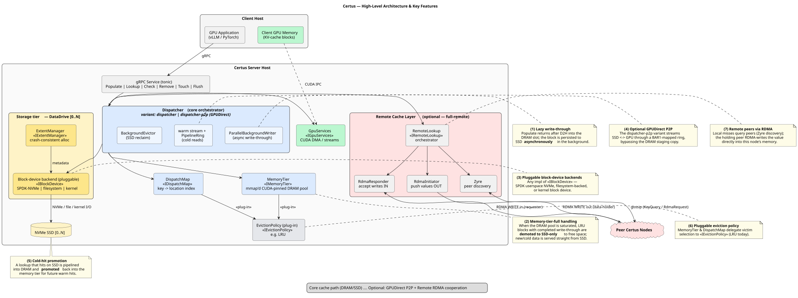

# Certus — High-Level Architecture & Key Features



Certus is a generative domain-specific cache/filesystem for GPU inferencing
workloads, built on a COM-inspired Rust component framework. A `certus-server`
process fronts a tiered cache (CUDA-pinned DRAM over NVMe SSD) behind a
shared-memory-queue (shmq) control API — a `/dev/shm` mailbox reached by
sharing the host IPC namespace — and can optionally cooperate with peer nodes
over RDMA.

Components are wired through typed interfaces (`I…`) and receptacles, so most of
the behaviour below is a matter of *which implementation is bound* rather than a
hard-coded path.

## Core path

```
GPU app --shmq--> Dispatcher --> MemoryTier (DRAM) --> BlockDevice --> NVMe SSD
                       |             ^                     ^
                       |             | promote (cold hit)  | async write-through
                    GpuServices (CUDA DMA / CUDA IPC to client GPU)
```

## Key features

1. **Lazy write-through.** `populate` copies the block GPU→DRAM (D2H) and
   returns as soon as it is registered in the dispatch-map; the
   `ParallelBackgroundWriter` persists it to SSD **asynchronously**. The entry
   is warm-servable from DRAM immediately and durable once write-through
   completes.

2. **Memory-tier-full handling.** When the DRAM pool is saturated, the
   dispatcher evicts LRU entries whose write-through has completed — **demoting
   them to SSD-only** — to make room. If every candidate is pinned by an
   in-flight transfer, the populate surfaces `PoolFull` rather than corrupting
   the pool. Cold data therefore ends up served straight from SSD under
   pressure. *(Design intent also allows bypassing DRAM straight to SSD when no
   space can be freed; the current plain dispatcher implements the
   demote-to-make-room form.)*

3. **Pluggable block-device backends.** The storage tier is any implementation
   of `IBlockDevice`: `block-device-spdk-nvme` (userspace SPDK),
   `block-device-filesys` (filesystem-backed, e.g. for testing), or
   `block-device-kernel`. Each DataDrive pairs a backend with an
   `ExtentManager` for crash-consistent space allocation.

4. **Optional GPUDirect P2P.** The `dispatcher-p2p` variant streams data
   directly between SSD and GPU through a BAR1-mapped staging ring (GDRCopy +
   SPDK-registered buffers), bypassing the DRAM staging copy on the cold path.
   It is opt-in (profile `full-p2p`); the default `dispatcher` uses the
   DRAM-staged pipeline (8-deep ring, 2 CUDA streams).

5. **Cold-hit promotion.** A lookup that misses DRAM but hits SSD is pipelined
   into a freshly allocated memory-tier slot and re-registered in the
   dispatch-map as a `MemoryTier` entry, so subsequent lookups are warm.

6. **Pluggable eviction policy.** Both `MemoryTier` and `DispatchMap` delegate
   victim selection to an `IEvictionPolicy` plug-in (`eviction-policy-lru`
   today), so the eviction strategy can be swapped without touching the cache
   engine.

7. **Remote peer requests via RDMA.** In the `full-remote` profile, a local
   miss is broadcast to peers (automatic Zyre gossip/beacon discovery). The
   requester reserves a landing slot in its RDMA-registered memory (via the
   `RdmaResponder`) and the holding peer RDMA-**writes** the value directly into
   it (via its `RdmaInitiator`) — a one-sided transfer with no CPU on the
   requester's critical path. See `profiles/full-remote/SYSTEM.md` for detail.

## Profiles

| Profile | Local DRAM+SSD cache | GPUDirect P2P | Remote RDMA cooperation |
|---------|:---:|:---:|:---:|
| `full` | ✓ | — | — (inert remote-lookup node) |
| `full-p2p` | ✓ | ✓ | — |
| `full-remote` | ✓ | — | ✓ |

Per-profile deployment, hit-flow, and put-flow diagrams live under
`profiles/<name>/`.
